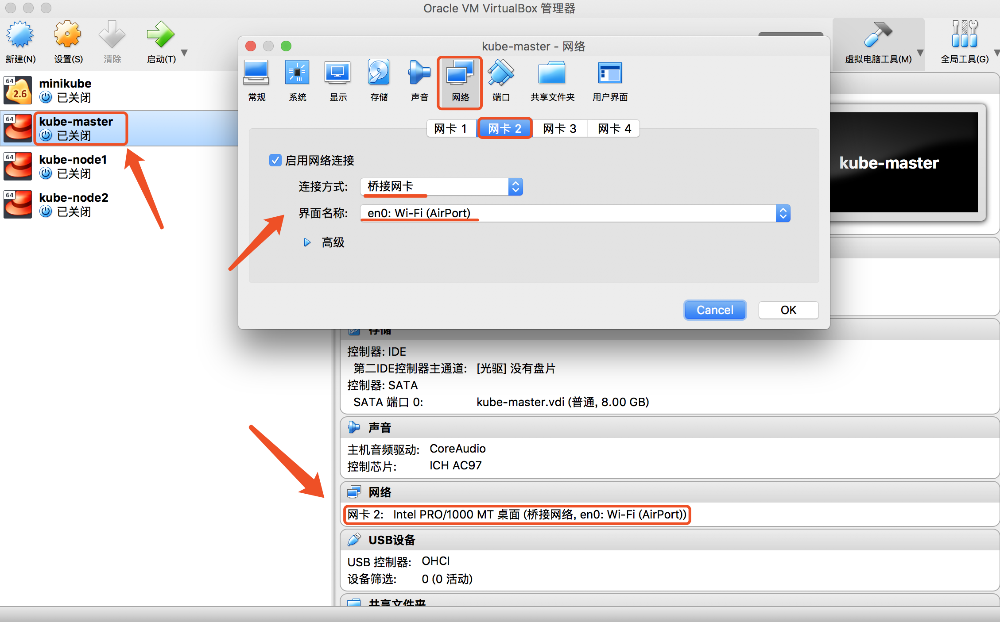
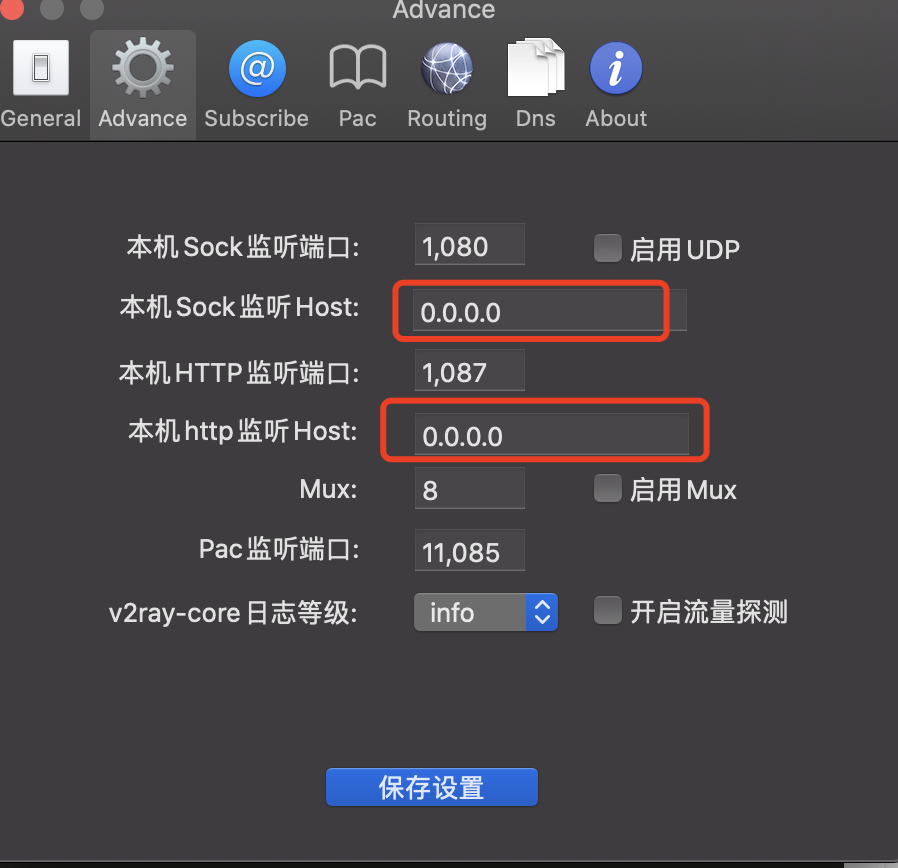

# k8s

## 0.安装手册
	1.	https://kuboard.cn/install/install-k8s.html
	2.	https://github.com/opsnull/follow-me-install-kubernetes-cluster


## 1.k8s-in-docker

### 0.linux centos docker
	参考安装手册1
### 1.build images
	docker build --rm -t 21guns.com/centos7-system .
### 2.run centos
	start-docker-k8s-centos.sh

### 问题
	1.初始化master, 异常  unsupported graph driver: fuse-overlayfs
		https://stackoverflow.com/questions/67953609/overlay2-driver-not-supported
	2.swap disable
		docker 无法关闭交换空间
		解决办法：kubeadm init --ignore-preflight-errors=Swap
	3.kubelet 异常 Failed to get the container runtime's cgroup
		尝试 ：http://www.mydlq.club/article/80/


## 2.k8s-in-vm
	参考安装手册2
### 0.准备
注意如下event，表明节点可用资源不够 ，pod将进行驱逐
  ```
164m        Normal    NodeHasSufficientMemory   node/k8s03           Node k8s03 status is now: NodeHasSufficientMemory
164m        Normal    NodeHasNoDiskPressure     node/k8s03           Node k8s03 status is now: NodeHasNoDiskPressure
164m        Normal    NodeHasSufficientPID      node/k8s03           Node k8s03 status is now: NodeHasSufficientPID
  ```
  `虚拟机的硬盘大小变更，最小15G`：https://segmentfault.com/a/1190000040229020

### 1. 虚拟机设置

#### 1.virtualbox设置虚拟机
下载centos 版本「Everything ISO」 http://isoredirect.centos.org/centos/7/isos/x86_64/	

	Mac 采用无线 wifi 接入外网
	查询 Mac 接入 wifi 的网卡：ifconfig 命令，查询到是网卡 en0
	为虚拟机配置一个网卡：设置 - 网络 - 网卡2
	连接方式：桥接网卡
	界面名称：en0: Wi-Fi(AirPod)
	启动虚拟机：在虚拟机内部 ping baidu.com 测试网络连通性


#### 2.vagrant 设置虚拟机
[Vagrantfile](vagrant/Vagrantfile) 

### 2. 参考安装手册2进行安装

#### 1.设置主机名
``` bash
hostnamectl set-hostname k8s01 
```
``` bash
cat >> /etc/hosts <<EOF
192.168.1.113 k8s01
192.168.1.124 k8s02
192.168.1.54 k8s03
EOF
```
#### 2.分发集群配置参数脚本
[environment.sh](manifests/environment.sh) 

#### 3.etcd

``` bash
cd /opt/k8s/work
cat > etcd-csr.json <<EOF
{
  "CN": "etcd",
  "hosts": [
    "127.0.0.1",
    "192.168.1.113",
    "192.168.1.124",
    "192.168.1.54"
  ],
  "key": {
    "algo": "rsa",
    "size": 2048
  },
  "names": [
    {
      "C": "CN",
      "ST": "BeiJing",
      "L": "BeiJing",
      "O": "k8s",
      "OU": "opsnull"
    }
  ]
}
EOF
```

#### 4.启动kubelet

kubelet无法启动
``` bash
[root@k8s02 kubernetes]# systemctl status kubelet -l
   kubelet.service - Kubernetes Kubelet
   Loaded: loaded (/etc/systemd/system/kubelet.service; enabled; vendor preset: disabled)
   Active: activating (auto-restart) (Result: signal) since 一 2021-12-06 15:42:25 CST; 4s ago
     Docs: https://github.com/GoogleCloudPlatform/kubernetes
  Process: 2141 ExecStart=/opt/k8s/bin/kubelet --bootstrap-kubeconfig=/etc/kubernetes/kubelet-bootstrap.kubeconfig --cert-dir=/etc/kubernetes/cert --network-plugin=cni --cni-conf-dir=/etc/cni/net.d --container-runtime=remote --container-runtime-endpoint=unix:///var/run/containerd/containerd.sock --root-dir=/data/k8s/k8s/kubelet --kubeconfig=/etc/kubernetes/kubelet.kubeconfig --config=/etc/kubernetes/kubelet-config.yaml --hostname-override=k8s02 --image-pull-progress-deadline=15m --volume-plugin-dir=/data/k8s/k8s/kubelet/kubelet-plugins/volume/exec/ --logtostderr=true --v=2 (code=killed, signal=SEGV)
 Main PID: 2141 (code=killed, signal=SEGV)

12月 06 15:42:25 k8s02 systemd[1]: kubelet.service: main process exited, code=killed, status=11/SEGV
12月 06 15:42:25 k8s02 systemd[1]: Unit kubelet.service entered failed state.
12月 06 15:42:25 k8s02 systemd[1]: kubelet.service failed.
```
执行`kubelet`出现如下错误：
```
[root@k8s02 bin]# kubelet
段错误
```
解决：重新安装kubelet

#### 6-6.calico
修改yaml文件不能有`制表符`，会出现如下问题
```
error: error parsing calico.yaml: error converting YAML to JSON: yaml: line 188: found character that cannot start any token
```
使用最新版`curl https://docs.projectcalico.org/manifests/calico.yaml -O`文件版本无法访问/apis/discovery.k8s.io/v1beta1/endpointslices资源，在1.16.6版本中，此api资源访问为404。pod错误日志如下：
```
[root@k8s02 ~]# kubectl logs -n kube-system calico-node-wg4fk
Error from server (BadRequest): container "calico-node" in pod "calico-node-wg4fk" is waiting to start: PodInitializing
```
需要使用`curl https://docs.projectcalico.org/v3.10/manifests/calico.yaml -o calico-3.10.yml` 这个版本文件。
参考链接
https://github.com/opsnull/follow-me-install-kubernetes-cluster/issues/633


#### 国内镜像

POD status = ImagePullBackOff #镜像拉取问题

#sed -i -e 's_k8s.gcr.io_registry.cn-hangzhou.aliyuncs.com_' manifests/*.yaml manifests/setup/*.yaml # 使阿里云镜像

kube-prometheus
git clone https://github.com/coreos/kube-prometheus.git
使用v0.7.0版本

### 3.使用ansible安装

#### 1.kubespray
```
# 免秘钥登录
ssh-copy-id -i ~/.ssh/id_rsa.pub root@192.168.56.13
gcl git@github.com:kubernetes-sigs/kubespray.git
git checkout v2.17.1
cp -rfp inventory/sample inventory/k8scluster
```
修改inventory/k8scluster/group_vars/all/all.yml文件追加如下内容
```
# gcr_image_repo: "gcr.mirrors.ustc.edu.cn"
# kube_image_repo: "registry.cn-hangzhou.aliyuncs.com/google_containers"

# gcr_image_repo: "googlecontainersmirror"
# kube_image_repo: "googlecontainersmirror"

# quay_image_repo: "quay.mirrors.ustc.edu.cn"
# docker_image_repo: "reg-mirror.qiniu.com"

# 使用主机的代理
http_proxy: "http://10.132.1.7:1087"
https_proxy: "http://10.132.1.7:1087"
```

```
pip3 install -r contrib/inventory_builder/requirements.txt

declare -a IPS=(10.10.1.3 10.10.1.4 10.10.1.5)
CONFIG_FILE=inventory/k8scluster/hosts.yaml python3 contrib/inventory_builder/inventory.py ${IPS[@]}

docker run --rm -it --mount type=bind,source="$(pwd)"/inventory/k8scluster,dst=/inventory \
  --mount type=bind,source="${HOME}"/.ssh/id_rsa,dst=/root/.ssh/id_rsa \
  quay.io/kubespray/kubespray:v2.17.1 bash
# Inside the container you may now run the kubespray playbooks:

ansible-playbook -i /inventory/hosts.yaml --private-key /root/.ssh/id_rsa cluster.yml
```

翻墙代理设置


all.yml追加如下配置
```
# 使用主机的代理
http_proxy: "http://10.132.1.7:1087"
https_proxy: "http://10.132.1.7:1087"
```

问题
1.kubespray docker 运行的分支和inventory/sample 使用的分支不一样
2.镜像翻墙下载问题
* 使用翻墙代理实现 -  可实现
* 使用国内镜像 - 大部分镜像不可用 

